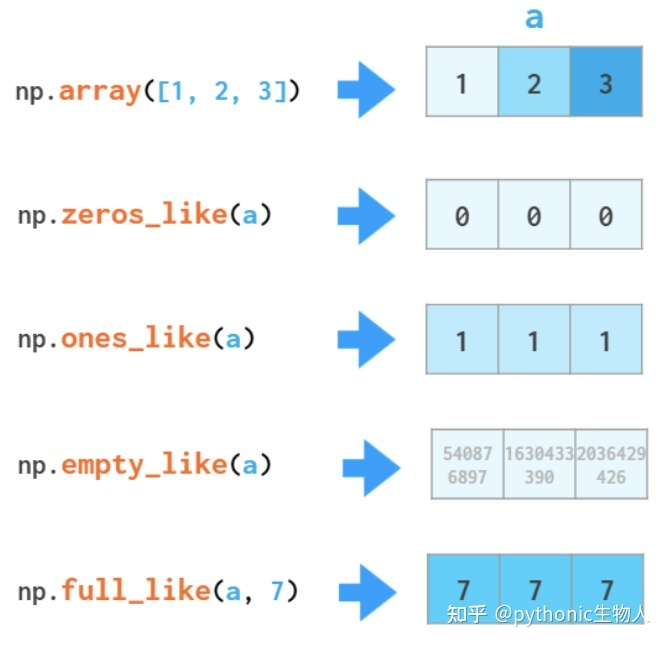
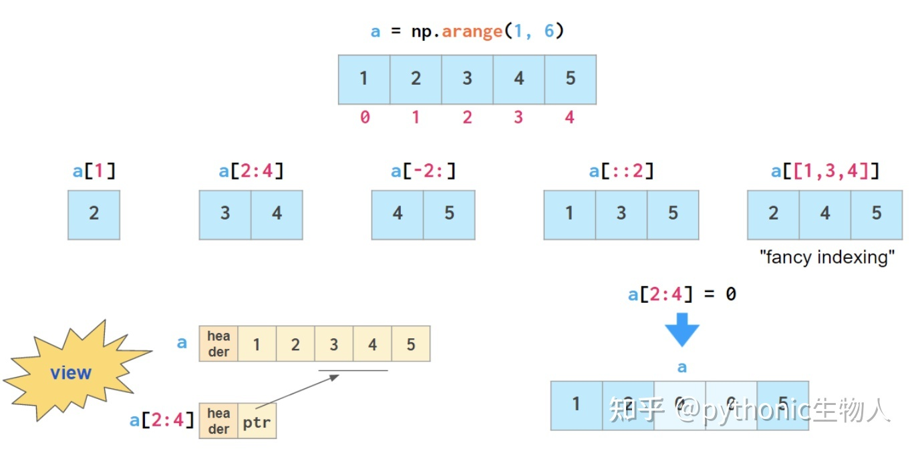
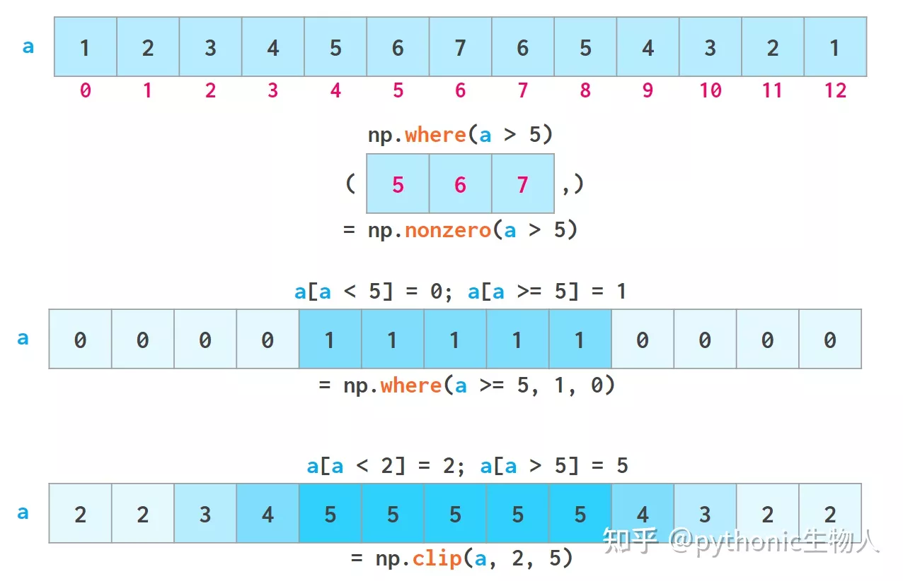

# NumPy 教程

本文参考: 

1. [NumPy Illustrated: The Visual Guide to NumPy](https://betterprogramming.pub/numpy-illustrated-the-visual-guide-to-numpy-3b1d4976de1d)
2. [A Visual Intro to NumPy and Data Representation](https://jalammar.github.io/visual-numpy/)


## 0. NumPy 速查手册


## 1. 安装
```bash showLineNumbers
pip install numpy
```

## 2. NumPy数组 vs Python 列表

- Numpy数组中插入、移除元素没Python列表高效；
- Numpy数组可直接做四则运算、Python列表则需借助列表推倒式等；

- Numpy数组更紧凑，高维时尤为明显；
- Numpy数组向量化后运算速度比Python列表更快；
- Numpy数组通常是同质化的，仅仅当数组中元素类型一致时处理速度快。

## 3. 一维数组: 向量
### 3.1 数组创建
#### a. 通过Python列表创建
```python showLineNumbers
import numpy as np
a = np.array([1., 2., 3.])

print(a)
```


:::caution
1. 必须确保列表中元素类型一致，否则NumPy进一步处理报错。
2. NumPy数组区别于Python列表，不能在数组末尾直接扩展元素。
::: 

#### b. 通过np.zeros等创建
```python showLineNumbers
import numpy as np
a = np.zeros(3)
b = np.ones(3)
c = np.random.random(3)

print(a)
print(b)
print(c)
```


#### c. 通过np.zeros_like等创建
```python showLineNumbers
import numpy as np
a = np.array([1,2,3])
b = np.zeros_like(a)
c = np.ones_like(a)
d = np.empty_like(a)
e = np.full_like(a)

print(a)
print(b)
print(c)
print(d)
print(e)
```


#### d. 通过np.arange或者np.linspace创建
```python showLineNumbers
import numpy as np
a = np.arange(6)
b = np.arange(2,6)
c = np.arange(1, 6, 2)
d = np.linspace(0, 0.5, 6)

print(a)
print(b)
print(c)
print(d)
```


### 3.2 数组索引
#### a. 常见的索引
```python showLineNumbers
import numpy as np
a = np.arange(1, 6)

print(a[1])
print(a[2:4])
print(a[-2:])
print(a[::2])
print(a[[1,2,3]])

a[2:4]=0

print(a)
```


#### b. 布尔运算符索引
```python showLineNumbers
import numpy as np
a = np.array([1,2,3,4,5,6,7,6,5,4,3,2,1])

print(np.any(a>5))
print(a[a>5])
print(np.all(a>5))
```


#### c. np.where/np.clip
```python showLineNumbers
import numpy as np
a = np.array([1,2,3,4,5,6,7,6,5,4,3,2,1])

print(np.where(a>5))
print(np.clip(a, 2, 5))
```



### 3.3 数学计算
计算速度是NumPy的亮点之一，其数组运算操作速度接近C++，把数组当作整体来运算，避免Python的循环，可以解决一部分Python慢的问题。

#### a. 加减乘除
```python showLineNumbers
import numpy as np
data = np.array([1,2])
ones = np.ones(2)

print(data + ones)
print(data - ones)
print(data * ones)
print(data / ones)
```


#### b. 最大值，最小值，求和
```python showLineNumbers
import numpy as np
data = np.array([1,2,3])

print(data.max())
print(data.min())
print(data.sum())
```


#### c. 三角函数
```python showLineNumbers
import numpy as np
a = np.array([1,2,3])

print(np.sin(a))
print(np.cos(a))
print(np.arcsin(a))
```

#### d. 其他的数学方法
```python showLineNumbers
import numpy as np
a = np.array([1,2,3])

print(a**2)
print(np.sqrt(a))
print(np.exp(a))
print(np.log(a))
```

### 3.4 广播